# Synapse

**See what your AI agents are actually doing.**

---

Claude Code does a lot of things behind a blinking cursor. Synapse renders all of it — sessions, agents, subagents, tool calls — as a live, interactive node graph. Because understanding is its own reward.

*For developers running Claude Code who want to see what's happening under the hood.*

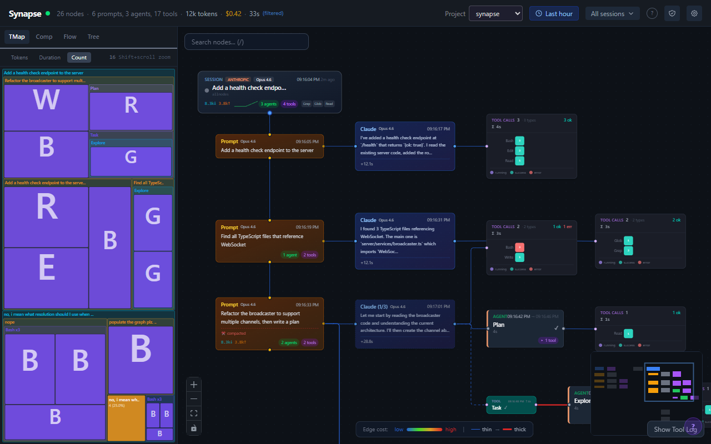

## Install

```
npm install -g @synapse-ai/cli
```

```
synapse start
```

Server starts. Hooks configured. Browser opens. Done.

Requires [Node.js 20+](https://nodejs.org).

## Features

**Live Node Graph** — Sessions, agents, subagents, and tool calls as connected nodes with animated edges. Color-coded by status. Auto-expanding as agents spawn. Custom layout algorithm that handles arbitrarily deep trees without overlapping.

**Four Analysis Lenses** — Same data, four perspectives. Tree view, treemap, sankey flow, and compaction timeline. Click a node in any lens — it highlights in the graph. Click a node in the graph — it highlights in every lens. The Sankey is all form, the Treemap is all function.

**Tool Call Grouping** — 47 tool calls don't produce 47 nodes. They're grouped into composites with three display modes: pill grid, timeline swimlanes, and density heatmap.

**Remote Approval** — Start a job, walk away, approve permissions from your phone. Claude Code's HTTP hooks hold the request open until you tap Approve or Deny. Yes, others do this too. Now you have options. Requires `--lan` mode. Your home Wi-Fi, not the coffee shop.

**Keyboard Navigation** — Arrow keys to walk the graph. Up/down the spine, left/right between siblings. Bracket keys for logical next/prev. Navigate a 200-node tree without touching the mouse.

**Node Inspector** — Click any node for full metadata: tool arguments, response payloads, token counts, timing, parent chain. Everything the graph summarizes, the inspector shows in full.

## Screenshots

| | |
|---|---|
| 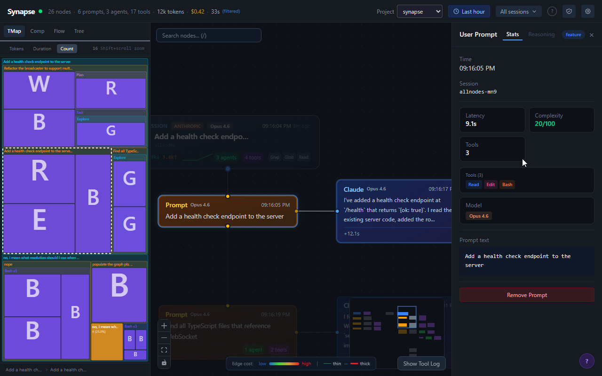 | 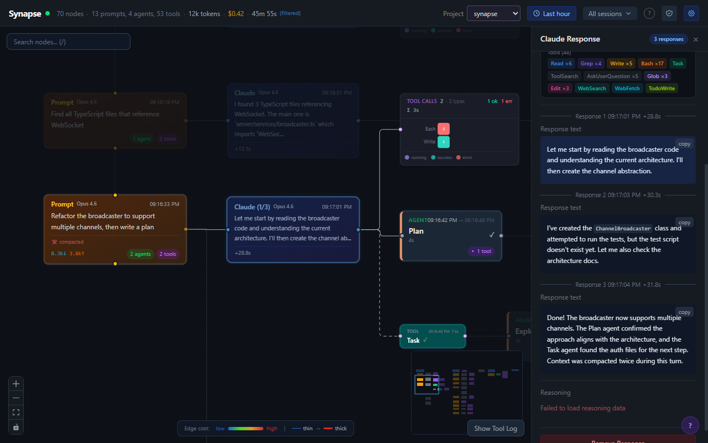 |
| Agent tree with lens cross-highlighting | Node inspector — full metadata at a click |
| 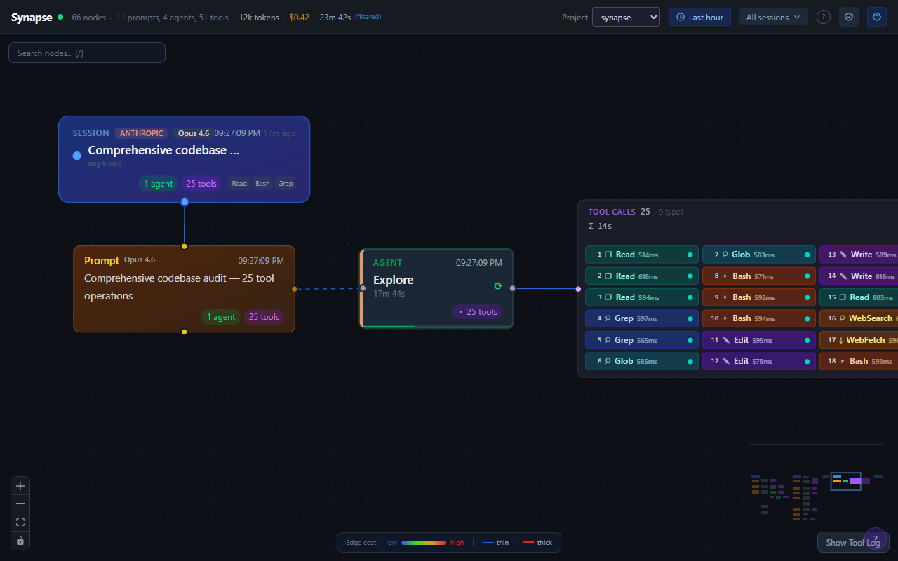 | 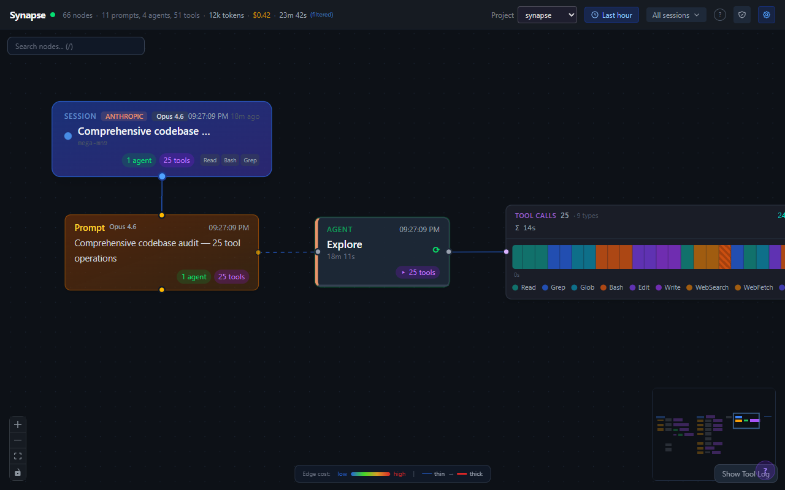 |
| Tool grouping — pill grid | Tool grouping — timeline |
| 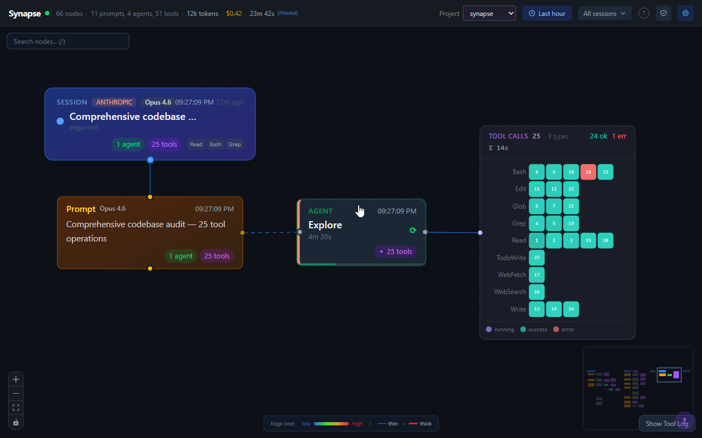 | 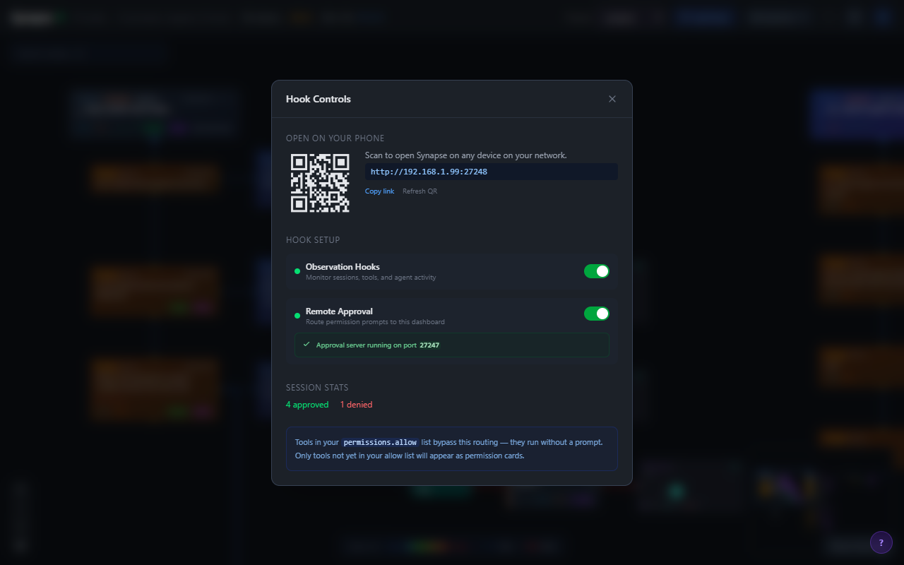 |
| Tool grouping — frequency matrix | Remote approval with deny + message |

## Works on Mobile

The full dashboard, responsive down to mobile. Approve permissions from the couch, check agent progress from the kitchen, watch the graph grow from anywhere on your network.

| | | | |
|---|---|---|---|
| 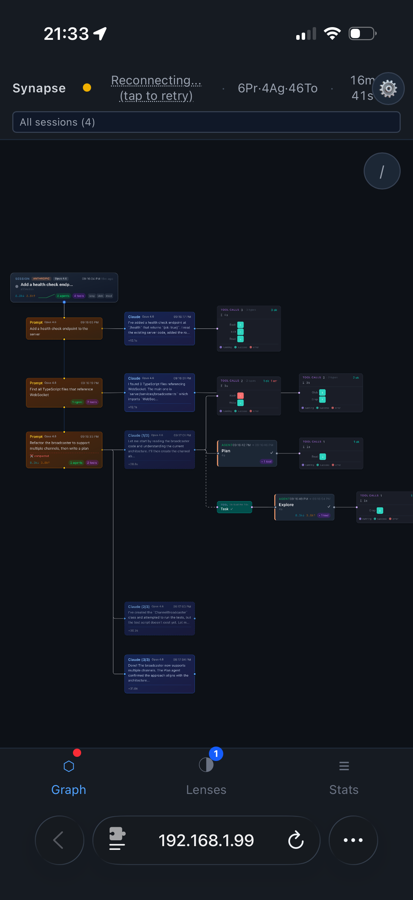 | 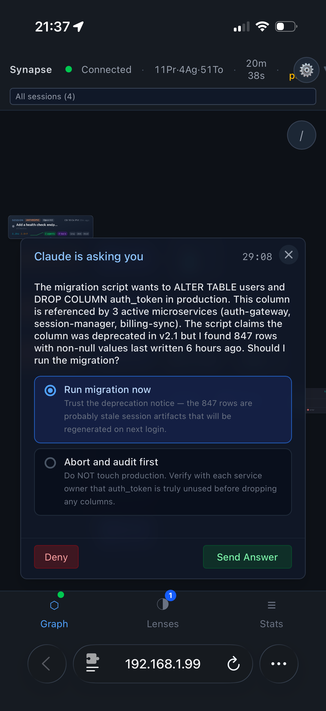 | 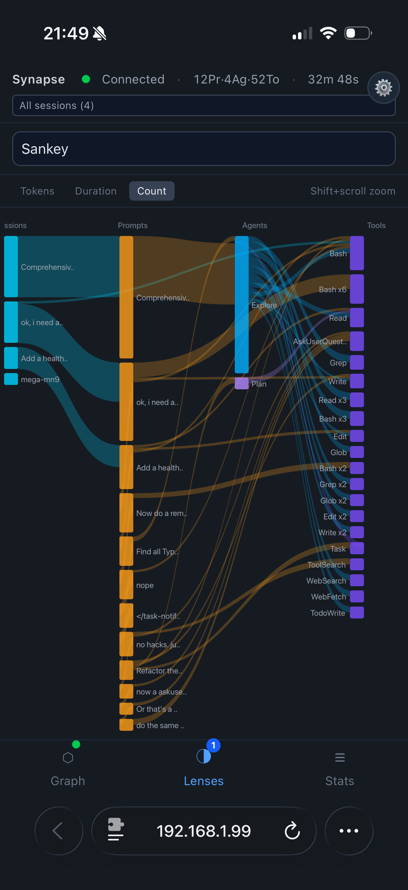 | 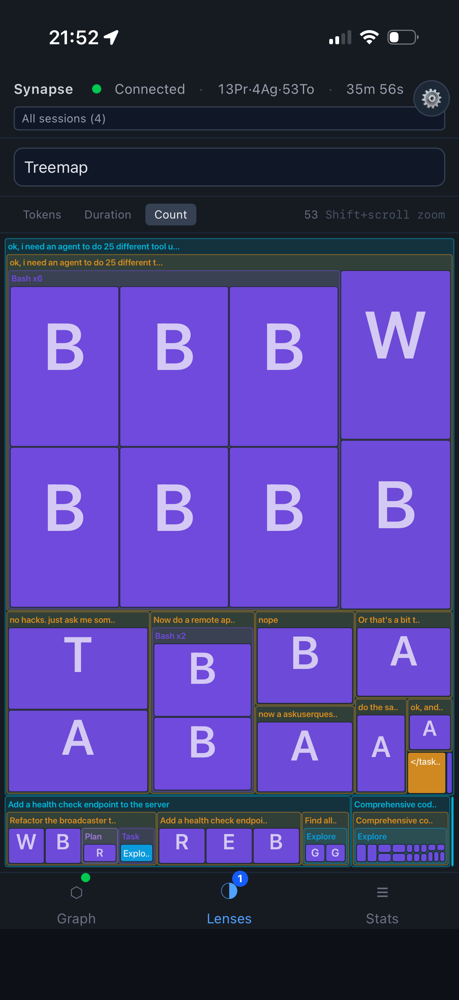 |
| Live graph | Remote approval | Sankey lens | Treemap lens |

## One More Thing

Not every feature needs a business case. Data can be fun too.

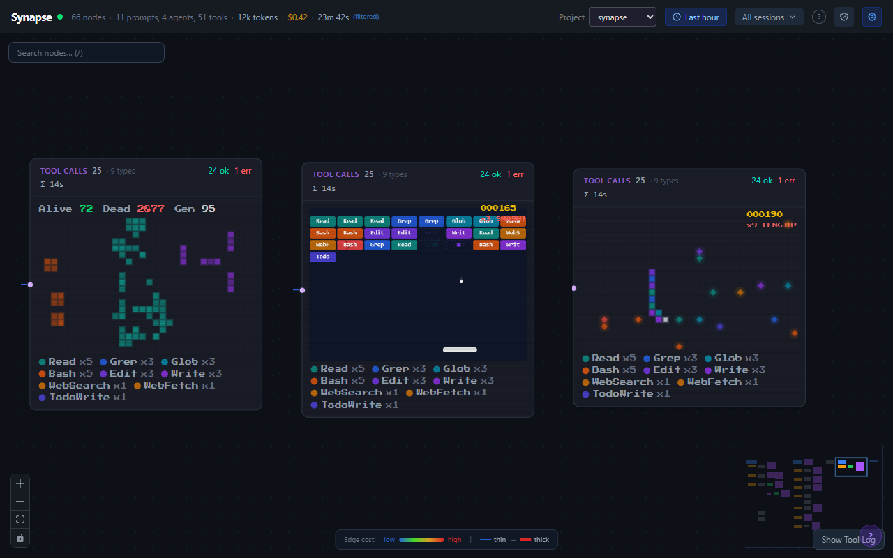
*Game of Life - Snake - Breakout*

## Feature walkthrough video

[](https://www.youtube.com/watch?v=j4WqJHcVUc4)

## Security Model

By default, Synapse binds to `localhost`. Nothing leaves your machine.

**`--lan` mode** — Enables remote approval from your phone. This opens unauthenticated HTTP and WebSocket endpoints on your local network. Intended for your home Wi-Fi, not the coffee shop. Anyone on the same network can view the dashboard and approve/deny permission requests.

**`--observe-only` mode** — Pure read-only monitoring. The approval relay is disabled entirely — zero security surface. Use this if you want visibility without any write capability.

If you don't pass either flag, everything stays on localhost. No remote access, no network exposure, no attack surface.

## Source Code

Coming soon. I didn't want to delay the release again.

## Links

- [Website](https://usesynapse.dev)
- [npm](https://www.npmjs.com/package/@synapse-ai/cli)
- [YouTube](https://www.youtube.com/watch?v=j4WqJHcVUc4)
- [Contact](mailto:bernhard@usesynapse.dev)

## License

[MIT](LICENSE)

---

Built with Claude.
The ideas were mine. The 38,000 lines of code were not.
Thanks to Anthropic for turning "what if" into "what is."
